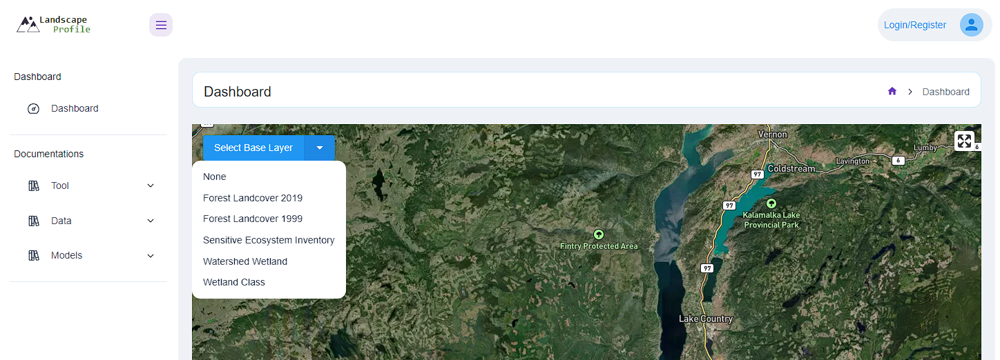
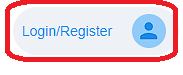
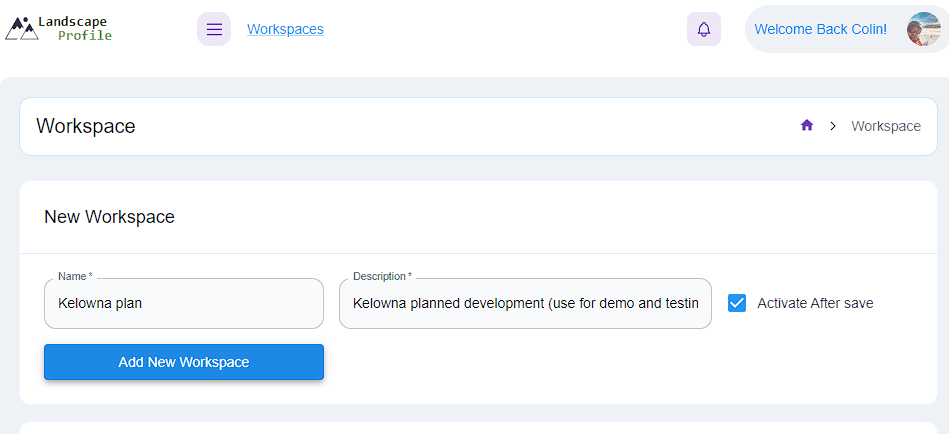
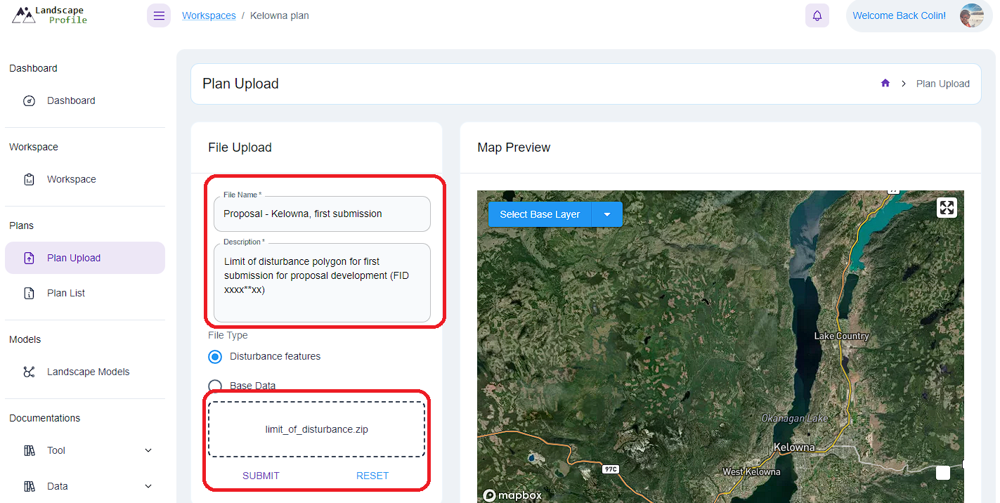
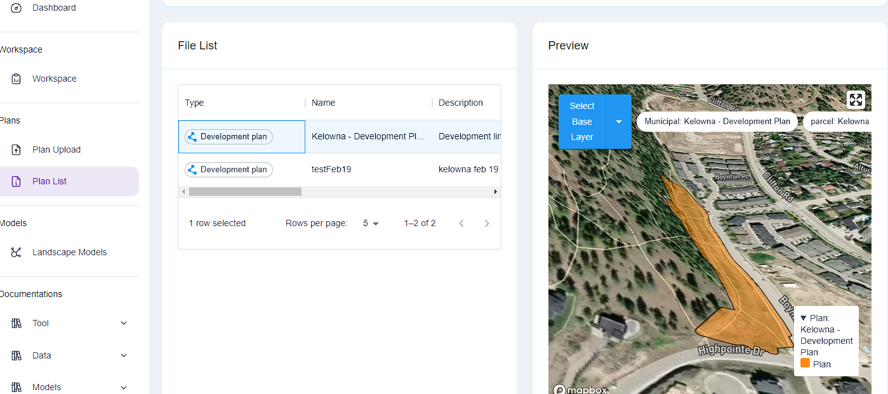
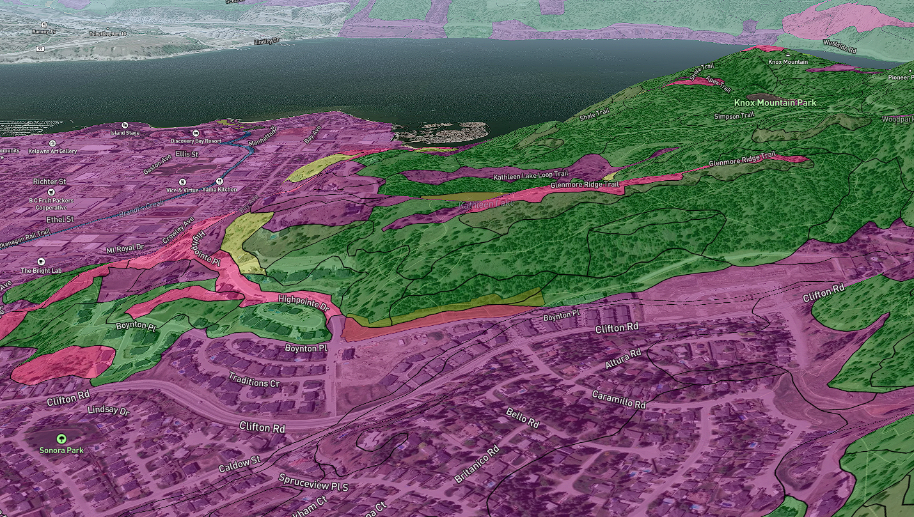

# Introduction to the Conservation Planning Tool

## Getting Started
The purpose of this tutorial is to provide a clear guide to overview the core functionality of the CPT. The analyses and reporting documented here is for demonstration purposes only.

### The Dashboard View
The first view of the CPT is a dashboard view which is essentially a map with available base layers. The map view should be set to the general area of interest you will be working in, which currently is limited to the Okanagan Region.

Not all base layers are viewable in the dashboard. Note that the map view can be maximized with the `Enter Fullscreen`  button in the top right corner. As well, the map view can be tilted to reveal a 3D landscape view using a right click and pan operation with the mouse. 

### Creating a User 
To run an analysis in the CPT you must be logged in as a registered user. A user can be created by clicking the top right button `Login/Register`  and users can use an existing account (Google or Microsoft) or an email to create a user account in the system.

### Workspaces
Workspaces can be thought of as distinct folders where collections of plans and models are stored. It may be useful to store all analyses associated with a particular development or project or season in a specific workspace. Using workspaces is optional, and if a new workspace is not created, the default workspace will be used automatically. 

Creating a new workspace is straightforward - just provide a name and description and whether you want this to be activated as the workspace that will be used for storing results.

### Data and Models Documentation
Detailed data and model documentation is available on the left panel of the CPT.

## A Sample Workflow
Assuming you have familiarized yourself with the basic interface and have a logged in registered user with the CPT, we can walk through a simple analysis to demonstrate the workflow. Here we will use some sample data from the City of Kelowna for demonstration purposes.

To complete the workflow below, first [download the sample data][../files/limit_of_disturbance.zip]

### Plan Upload
`Click` on the `Plan Upload` link on the left panel. Enter in details associated with this plan (which is development proposal in the City of Kelowna, B.C.). `Click` on the `Drag file here to upload` button and navigate to the sample dataset downloaded above. `Click submit` to upload the plan polygon zip file to the system. You should get a notification that a process has started.

After a successful upload has run, you can view the uploaded plan in the `Plan List` section. Here you can inspect the geometry of the plan by clicking on the row, which will update the map view to visualize the plan in relation to the local area. As well, details of the plan - description, workspace, file name, upload time, etc. are available in the table. 

The Map View in the Plan List interface can be expanded to full screen. As well, base layers can be turned on to examine their relation to the plan polygon. This may inform what layers to use in a subsequent model analysis. Note also that by right clicking on the map and panning, the perspective of the map view can be rotated to reveal topographyof the area. For example here is the view of the plan with SEI layer turned on and rortated to look westward across Okanagan Lake.

<!---->

### Running a Landscape Model

### Viewing the Report

## Advanced Topics

### User-uploaded Base Layers

### Modifying Reference Zones

### Aggregation Fields

### Adding New Landscape Models

### Adding New Core Base Layers